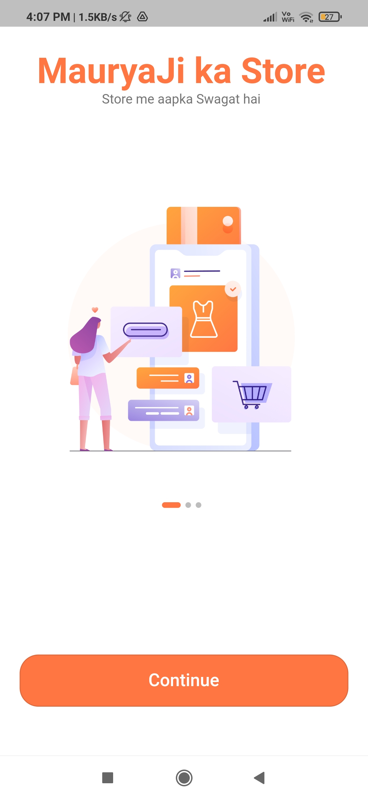
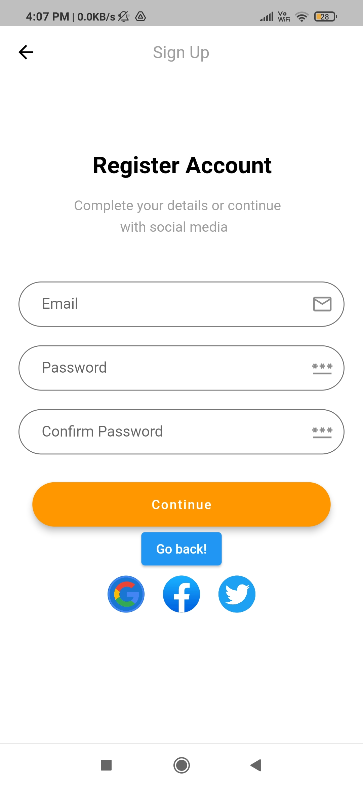

# E-Commerce App - Flutter UI
An E-commerce app UI for your shopping needs, made with Flutter framework.

[]()
[]()
<br>

## Feature List
- **Loading screens** to reduce waiting time and provide easy app transitions
- **Dynamic home page** featuring a diverse range of shopping categories, personalised products and ongoing discounts.
- **Search bar** to quickly find the desired products.
- **Cart** to effortlessly add products, view a summary of your selected items, and apply vouchers or promo codes for exclusive discounts before proceeding to checkout.
- **Profile** UI.

# Visuals of the App

<table>
  <tr>
     <td>Loader Screen</td>
     <td>Sign In Screen</td>
     <td>Sign Up Screen</td>
     <td>Login Success Screen</td>
  </tr>
  <tr>
    <td></td>
    <td></td>
    <td></td>
    <td></td>
  </tr>
 </table>

<table>
  <tr>
     <td>Home Screen</td>
     <td>Cart Screen</td>
     <td>Profile Screen</td>
  </tr>
  <tr>
    <td></td>
    <td></td>
    <td></td>
  </tr>
</table>
<br>

<table>
  <tr>
     <td>Loader</td>
     <td>Login-Signup</td>
     <td>Login Success</td>
     <td>Home Screen Demo</td>
  </tr>
  <tr>
    <td></td>
    <td></td>
    <td></td>
    <td></td>
  </tr>
  </table>


Please star⭐ the repo if you like what you see.
<br>

## Installation
1. Clone the repository or download the code files.
2. Go to project root and execute the following command in console to get the required dependencies:
```
flutter pub get 
```
3. Run the following command to get the app started:
```
flutter run
```
